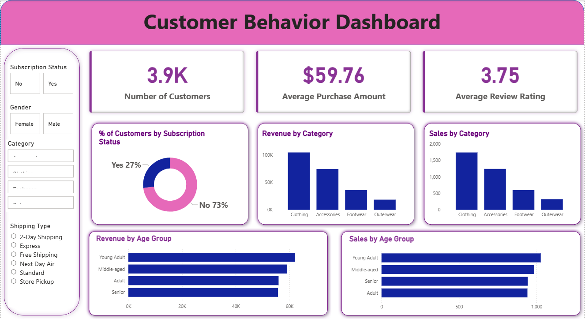

# Customer Shopping Behavior Analysis

## Problem Statement
An e-commerce business needed to move beyond generic marketing and understand its customer base to drive growth. The key challenge was to extract actionable insights from raw shopping data to identify high-value segments and purchasing patterns.

## Objective
The primary objective of this project is to conduct a comprehensive analysis of customer shopping behavior to answer key business questions and provide data-driven recommendations. This involves a full data analysis workflow, from data cleaning and preparation to in-depth analysis and visualization.

## Data Collection
The dataset for this analysis is `shopping_behavior_updated.csv`, a flat file containing 3,900 records and 18 columns detailing customer demographics, transaction information, and product details.

### Key Data Points:
*   **Customer Demographics:** Age, Gender, Location
*   **Transaction Details:** Purchase Amount (USD), Payment Method, Shipping Type
*   **Product Information:** Item Purchased, Category, Review Rating
*   **Customer Behavior:** Previous Purchases, Subscription Status, Frequency of Purchases

## Project Workflow

This project follows a standard data analysis workflow from data preparation to visualization:

1.  **Data Cleaning and Preparation (Python):**
    *   The raw CSV data was loaded into a pandas DataFrame.
    *   Missing values in the `review_rating` column were handled by imputing the median rating for the respective product category.
    *   Column names were standardized to a snake_case format for consistency.
    *   Feature engineering was performed to create new, insightful columns:
        *   `age_group`: Categorized customers into 'Young Adult', 'Adult', 'Middle-aged', and 'Senior'.

2.  **Data Loading (Python -> SQL):**
    *   The cleaned and prepared DataFrame was loaded into a SQL database (PostgreSQL) using SQLAlchemy, enabling robust and efficient querying.

3.  **Exploratory Data Analysis (SQL):**
    *   A series of SQL queries were executed to answer specific business questions, such as segmenting customers and identifying top-rated products.

4.  **Data Visualization (Power BI):**
    *   An interactive dashboard was created in Power BI, connected directly to the SQL database. The dashboard provides a visual representation of the findings, making it easy for stakeholders to understand the insights.

  

## Key Insights

The analysis yielded several key insights into customer behavior:

*   **Gender and Spending:** Male customers generated a total revenue of **$157,890**, while female customers generated **$75,191**.
*   **Top Rated Products:** The top 5 products with the highest average review ratings are:
    1.  **Gloves** (Avg. Rating: 3.86)
    2.  **Sandals** (Avg. Rating: 3.84)
    3.  **Boots** (Avg. Rating: 3.82)
    4.  **Hat** (Avg. Rating: 3.80)
    5.  **Skirt** (Avg. Rating: 3.78)
*   **Impact of Subscriptions:** There is no significant difference in spending between subscribed and non-subscribed customers. The average purchase amount for subscribed customers is **$59.49**, compared to **$59.87** for non-subscribers.
*   **Customer Segmentation:** Based on the number of previous purchases, the customer base is segmented as follows:
    *   **Loyal Customers** (>10 previous purchases): **79.9%**
    *   **Returning Customers** (2-10 previous purchases): **18.0%**
    *   **New Customers** (1 previous purchase): **2.1%**
*   **Revenue by Age Group:** The revenue contribution is fairly evenly distributed across age groups:
    *   **Young Adult:** 26.7%
    *   **Adult:** 24.0%
    *   **Middle-aged:** 25.4%
    *   **Senior:** 23.9%

## Tools and Technologies
*   **Python:** pandas for data manipulation and cleaning, SQLAlchemy for database interaction.
*   **SQL (PostgreSQL):** For in-depth data analysis and querying.
*   **Power BI:** For creating interactive dashboards and visualizations.
*   **Git & GitHub:** For version control and project hosting.

## Conclusion and Recommendations

The analysis provided clear, data-driven recommendations. For instance, it highlighted that while male customers generate over double the revenue of female customers, the spending habits between subscribed and non-subscribed users are nearly identical. This insight allows the business to refocus its marketing efforts on high-revenue demographics and rethink its subscription value proposition.

The analysis provided clear, data-driven recommendations. For instance, it highlighted that while male customers generate over double the revenue of female customers, the spending habits between subscribed and non-subscribed users are nearly identical. This insight allows the business to refocus its marketing efforts on high-revenue demographics and rethink its subscription value proposition.
